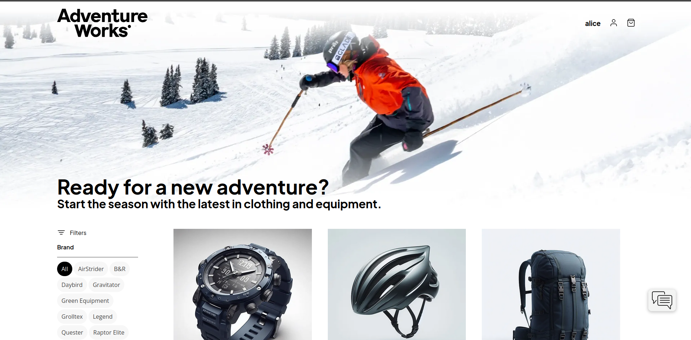
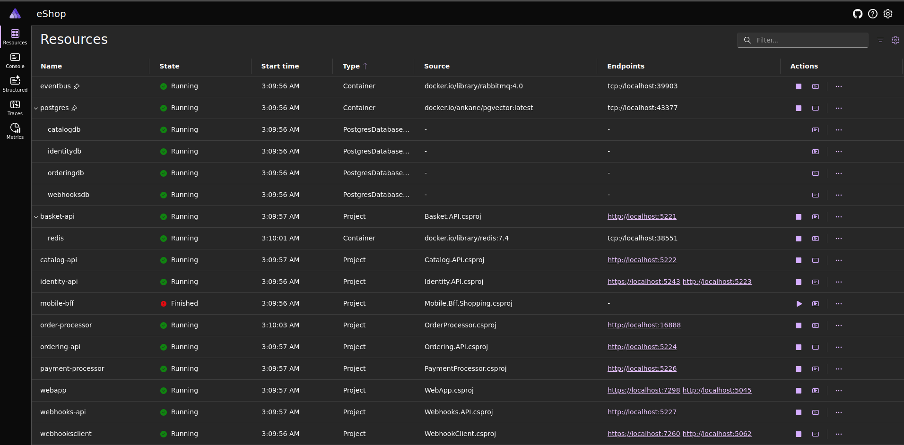
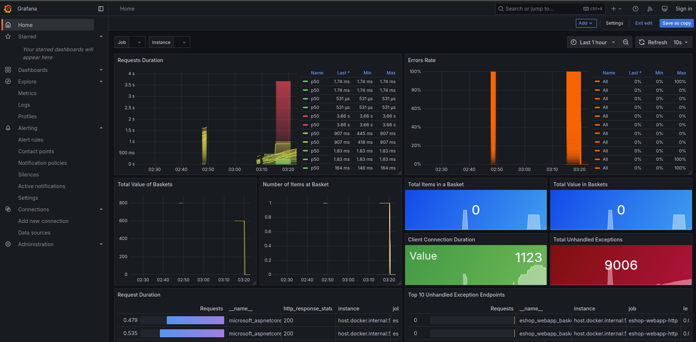
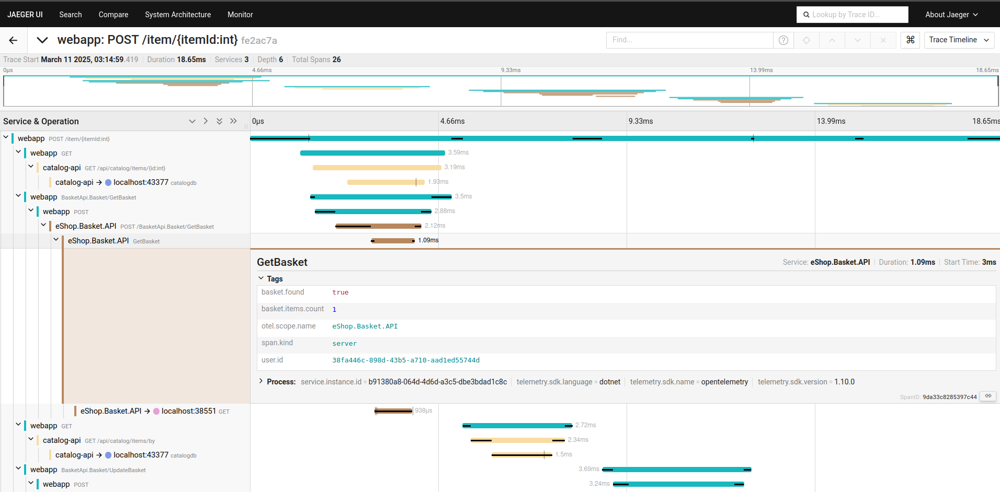
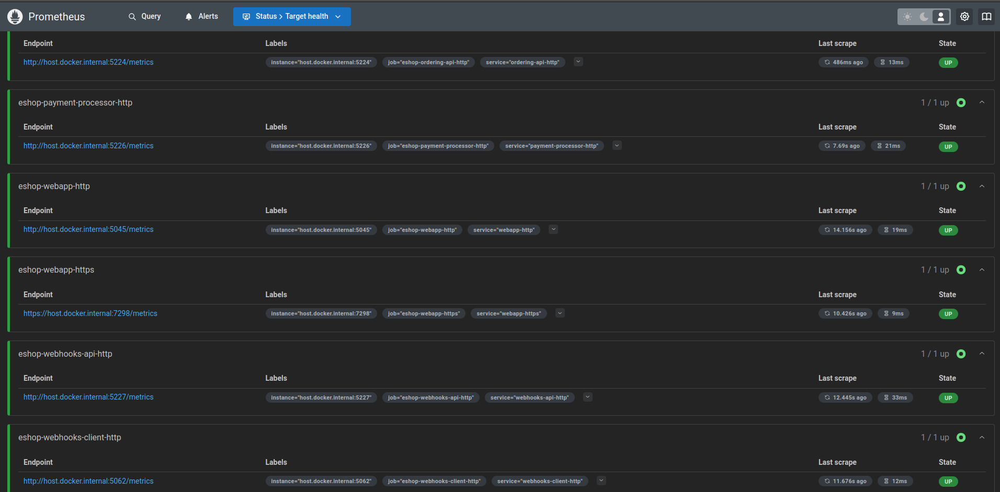
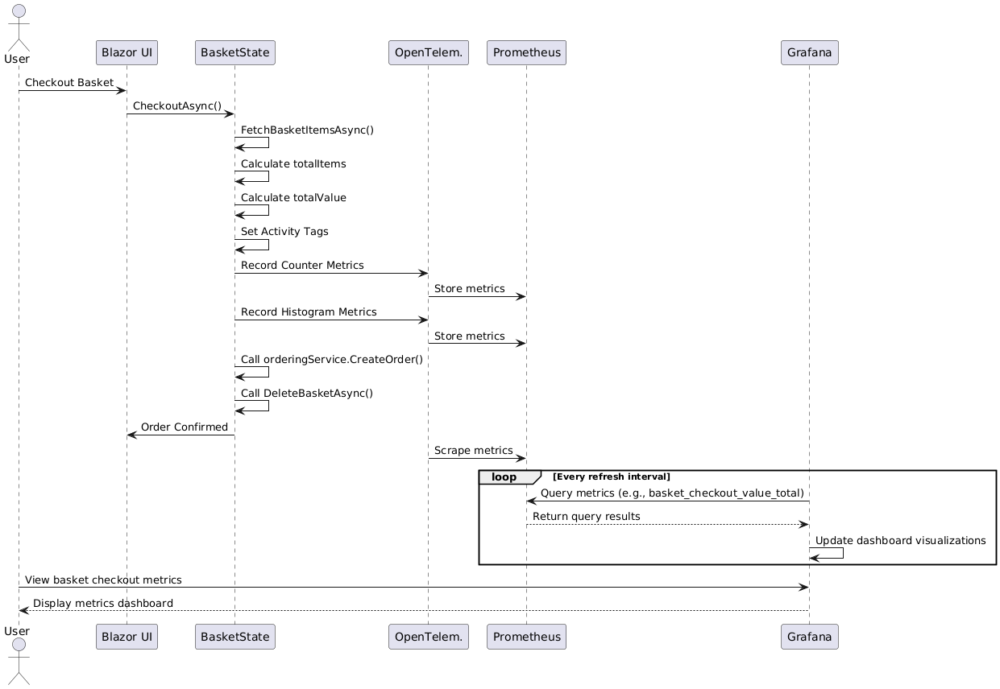

# Integrating OpenTelemetry & Security in eShop

## 📌 Objective
This project adds **OpenTelemetry tracing** to the "Add to Cart/Checkout" feature of the eShop system. The implementation includes:

- End-to-end **tracing** of the "Add to Cart/ Checkout" workflow (Frontend → Basket API → Database)
- **Masking sensitive data** (userId, emails, payment details) from logs and telemetry
- **Exporting metrics to Prometheus and Jaeger** and visualizing them in **Grafana**
- **Load testing** using locust, to observe performance and system behavior

Report avaliable at  https://github.com/Miragaia/PROJECT1_AS/Report-AS.pdf
---

## **1: Prerequisites**
Ensure you have the following installed:
- **.NET 9 SDK**
- **Docker & Docker Compose**
- **Prometheus &  Jaeger & Grafana** (are in docker)
- **locust** 


## **2: How to run**
At the project root, run:

```bash
docker compose -f docker-compose.observability.yml up -d
```

Then, start the application:

```bash
dotnet run --project src/eShop.AppHost
```

## **3: Usage**
### **🛒 WebApp (eShop Interface)**
- Open the web application in your browser:
  ```
  https://localhost:7298/
  ```



---

### **🛒 Dashboard WebApp (listed services)**
- Open the dashboard web application in your browser:
  ```
  https://localhost:7298/
  ```



---

### **📊 Grafana Dashboard**
- Access Grafana at:
  ```
  https://localhost:3000
  ```
- Log in (default credentials):
  - **User:** admin
  - **Password:** admin



---

### **🔍 Jaeger Tracing**
- Access Jaeger at:
  ```
  https://localhost:16686
  ```
- Search for traces related to **Basket API (Add to Cart workflow)**.
- Analyze **service dependencies** and **additional tags**.



---

### **📡 Prometheus Monitoring**
- Access Prometheus at:
  ```
  https://localhost:9090
  ```



---

## Tracing & Monitoring Flow  (Sequence Diagram)




This sequence diagram illustrates the **"Add to Cart" and Checkout flow** with OpenTelemetry integration for tracing and monitoring.  

1. **User initiates checkout** via the **Blazor UI**.  
2. The UI calls the **BasketState**, which:  
   - Fetches basket items  
   - Calculates total items and value  
   - Sets activity tags for tracing  
3. **OpenTelemetry records key metrics** like:  
   - Counter metrics (e.g., total checkouts)  
   - Histogram metrics (e.g., checkout value distribution)  
   - These metrics are sent to **Prometheus** for storage.  
4. The basket service processes the order by:  
   - Calling `orderingService.CreateOrder()`  
   - Clearing the basket  
5. **Prometheus scrapes OpenTelemetry** at regular intervals to collect new metrics.  
6. **Grafana queries Prometheus** periodically to fetch the latest checkout metrics.  
7. **User views the Grafana dashboard** with real-time checkout insights.  
